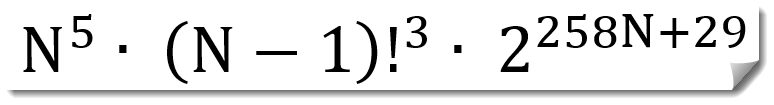

# BTCrypto

Implements cryptographic algorithms on Java, including the official [CuaimaCrypt](#what-is-cuaimaCrypt) source code.

This project is provided "AS IS", no warranty, no responsibilities, no more documentation that the one included in this
repository.

## What is CuaimaCrypt

CuaimaCrypt library was born on May 28, 2007.

The first decision was what kind of algorithm would be, one of block coding or pseudo-random sequences coding bits; 
after much research and testing we integrate both models into one, developing "Shift Codec", which allows a non-cyclic
code with pseudo-random sequence.

These Shift Codecs are grouped in Rake Codec, which can process simultaneously 128 bits and these are grouped in
sequence of bits by scramblers with four possible operations. The Shift Codecs are chained with other Shift Codecs,
which makes his states dependant of the data entered into the process; additionally a sequence of Shift Codec's hopping
states.

This coding structure allows to extend the security of the algorithm to the particular needs of everyone just adding
more blocks.

All the initial parameters of the algorithm, seeds, scramblers between blocks, seeds hopping sequence, Shift Codec
chains, all of them are initialized by the key who define the Lorenz attractors' states.

The equation that define the possible combinations of CuaimaCrypt’s configuration is:

CuaimaCrypt-Equation

Where N is the number of blocks in the algorithm.

| Number of Blocks N | CuaimaCrypt’s Configuration Combinations | Equivalent Key Bits Length |
|--------------------|------------------------------------------|----------------------------|
| 2                  | 3.6855x10 ^ 165                          | 550                        |
| 4                  | 5.4648x10 ^ 324                          | 1078                       |
| 6                  | 7.1220x10 ^ 484                          | 1610                       |
| 9                  | 2.0384x10 ^ 726                          | 2412                       |
| 16                 | 5.6466x10 ^ 1293                         | 4297                       |
| 32                 | 2.0153x10 ^ 2603                         | 8647                       |
| 64                 | 1.8187x10 ^ 5250                         | 17440                      |
| 128                | 8.2660x10 ^ 10600                        | 35215                      |
| 256                | 5.9661x10 ^ 21416                        | 71144                      |
| 512                | 4.2701x10 ^ 43278                        | 143768                     |
| 1024               | 4.6637x10 ^ 87463                        | 290548                     |

In perspective at the observable universe we have in a gross underestimation of 1x10^29 stars according to astronomers'
estimates. If we compare these values with known symmetric key algorithms we can see:

- AES: 256 bits
- Blowfish: 448 bits
- Serpent: 256 bits
- Twofish: 256 bits
- GOST: 256 bits
- REDOC: 160 bits
- IDEA: 128 bits
- MMB: 128 bits
- SAFER K-128: 128 bits
- NewDES: 120 bits
- 3-WAY: 96 bits
- CRAB: 80 bits
- SKIPJACK: 80 bits (Clasificated algorithm by NSA)
- CAST: 64 bits
- Madryga: 64 bits
- FEAL: 64 bits
- LOKI: 64 bits
- SAFER K-64: 64 bits
- DES: 56 bits

As we can see with 6 blocks; CuaimaCrypt has 1610 bits, which is about 3.5 times the level of security offered by Blowfish.

Another CuaimaCrypt's feature is that the security level is not determined by the length of the password, in the extreme
case that key is just one letter, all the initial values are generated by the Lorenz attractors, one key of less than
9 chars is not recommended as it would be extremely vulnerable to a brute force attack against the key itself, so the
security of the key is the user's responsibility.

At algorithm tests, medium files (1 MB) in size, it has a completely flat distribution of characters, with a variation
of only 0.05% maximum over all the ASCII table.

## Dependencies

This library depends on [BTUtils](https://github.com/BolivarTech/BTUtils) library.

## Credits

- [Julian Bolivar](https://www.linkedin.com/in/jbolivarg/)

## License

Copyright © [BolivarTech](https://www.bolivartech.com) 2022 All Rights Reserved.

BtCrypto and CuaimaCrypt © 2022 by [Julian Bolivar](https://www.bolivartech.com) is licensed under [Attribution-ShareAlike 4.0 International](https://creativecommons.org/licenses/by-sa/4.0/legalcode)

Please see [License File](LICENSE.md) for more information.